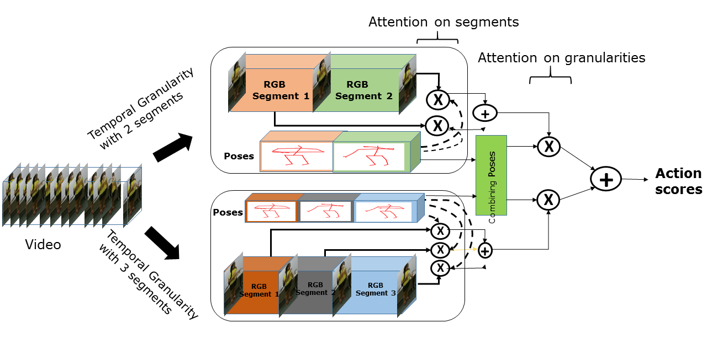

# Temporal Model (WACV 2020)

## REQUIRED PACKAGES AND DEPENDENCIES

* python 3.6.8
* Tensorflow 1.13.0 (GPU compatible)
* keras 2.3.1
* scikit-image 0.16.2
* Pillow 6.2.1
* OpenCV 4.1.2
* Cuda 10.0
* CuDNN 7.4
* tqdm 4.41.1

## INSTALLATION INSTRUCTIONS

Ensure that Cuda 10.0 and CuDNN 7.4 are installed to use GPU capabilities.

Ensure Anaconda 4.7 or above is installed using `conda info`, else refer to the [Anaconda documentation](https://docs.anaconda.com/anaconda/install/)

The following commands can then be used to install the dependencies:

```bash
conda create --name tensorflow-gpu1.13 tensorflow-gpu==1.13.1 keras scikit-image opencv
conda create --name pytorchenv pytorch==1.0.1 torchvision==0.2 tensorflow-gpu==1.13.1 keras scikit-image opencv "pillow<7" tqdm
```
## PRE-TRAINED MODELS

The pretrained 3DCNN model can be downloaded from https://drive.google.com/drive/folders/1WE5srEZjth_Or1--lLG3cwCuqjugsDh1?usp=sharing as well as the skeleton files. Extract to the data folder.

## I3D segment wise Features

Will be available soon


## Reference
<a id="1">[1]</a>
S. Das, F. Bremond and M. Thonnat. "Looking deeper into Time for Activities of Daily Living Recognition". In Proceedings of the IEEE Winter Conference on Applications of Computer Vision, WACV 2020, Snowmass village, Colorado, March 2-5, 2020.
